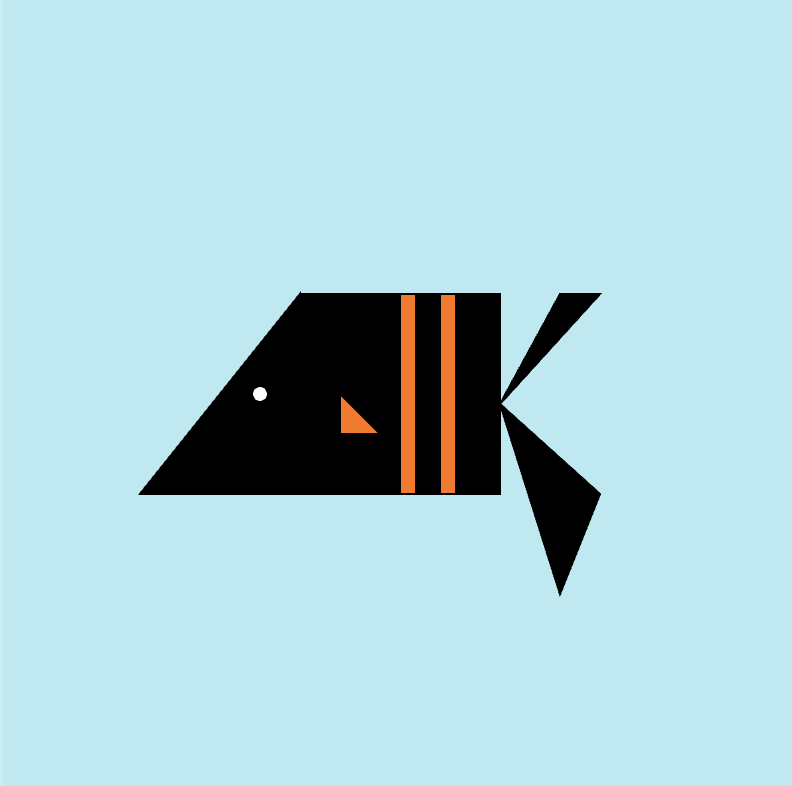
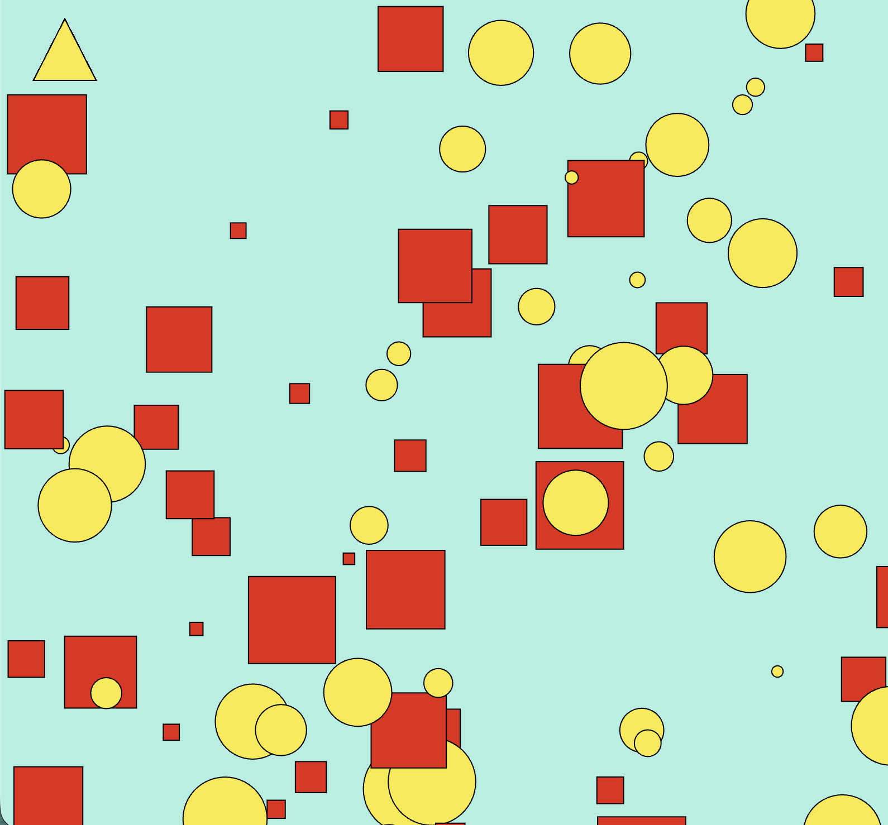

# Week 01 — Basics & Drawing with Code

---

### Activities

| Activity | What I Made                   |
| -------- | ----------------------------- |
| `1a`     | Created a simple fish-like creature using basic shapes, colors, and coordinates in p5.js. |
| `1b`     | Experimented with randomness to generate an evolving composition of colorful geometric shapes. |

---

### This Week

I learned the basics of p5.js and how to draw with code. I explored how setup() and draw() work, how the canvas coordinate system is structured, and how shapes are layered depending on the order of the code. I also experimented with basic shapes, colors, and styling using functions like fill() and stroke().

---

### Output

---
