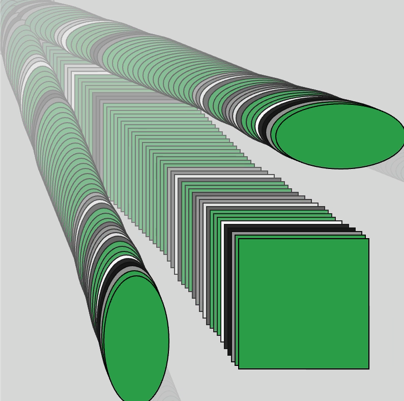
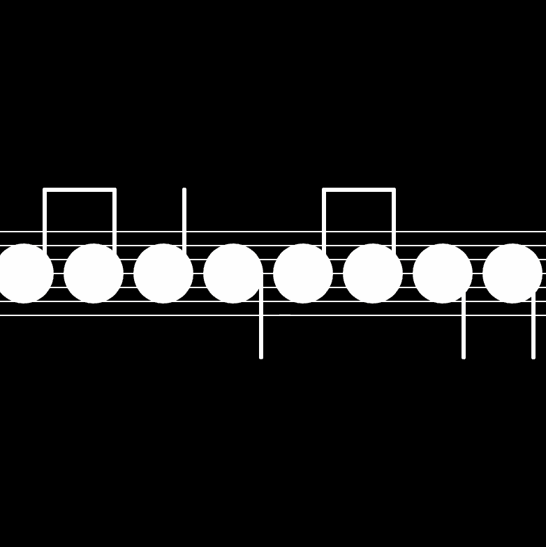

# Week 02 — Conditionals & Loops

---

### Activities

| Activity | What I Made                   |
| -------- | ----------------------------- |
| `2a`     | Experimented with conditionals and movement to create overlapping geometric trails that change when clicking the sketch. |
| `2b`     | Used loops, modulo, and mouse interaction to create a repeating pattern inspired by musical notes and staff lines. |

---

### This Week

I explored conditionals and loops in p5.js. I learned how if and else can make the program respond to different conditions, while for loops make it easier to repeat shapes and create patterns. I also experimented with modulo to create alternating patterns.

---

### Output

---