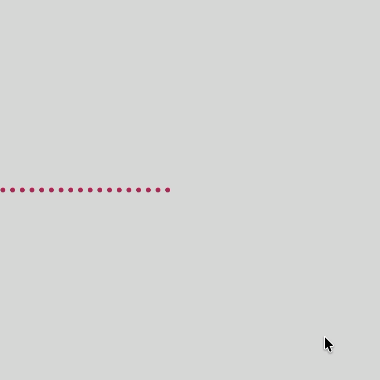
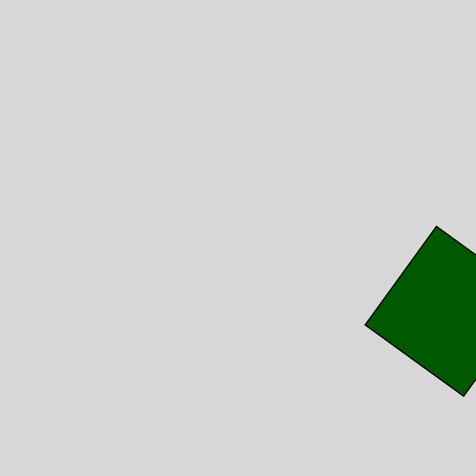

# Week 03 — Arrays & Functions

---

### Activities

| Activity | What I Made                   |
| -------- | ----------------------------- |
| `3a`     | Experimented with arrays by adding and removing colors through mouse and keyboard interactions. |
| `3b`     | Practiced creating reusable functions with parameters and used transformations like translate() and rotate() to animate shapes. |

---

### This Week

I learned how to organize my code using arrays and functions. I also explored transformations like translate(), rotate(), and scale() to move and change shapes more easily. Using push() and pop() helped me understand how to apply transformations without affecting everything else on the canvas.

---

### Output

---