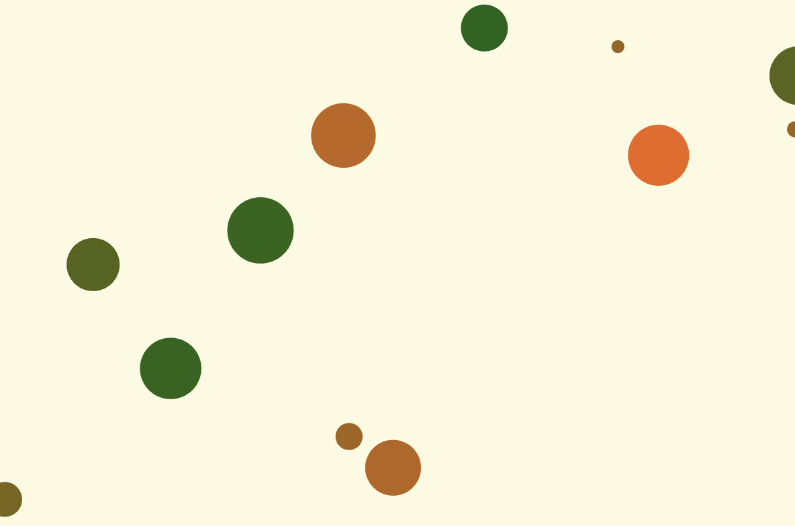

# Week 04 — Blueprints & Objects

---

### Activities

| Activity | What I Made                   |
| -------- | ----------------------------- |
| `4a`     | Practiced classes and objects by creating a cookie with properties and methods for changing its position and flavor. |
| `4b`     | Created multiple moving objects with a class and experimented with changing their size, color, and bouncing behavior over time. |

---

### This Week

This week, I learned how classes and objects can make my code more organized and reusable. I explored how constructor() defines an object’s properties and how methods control its behavior. I also practiced creating multiple objects from the same class using arrays.

---

### Output

---