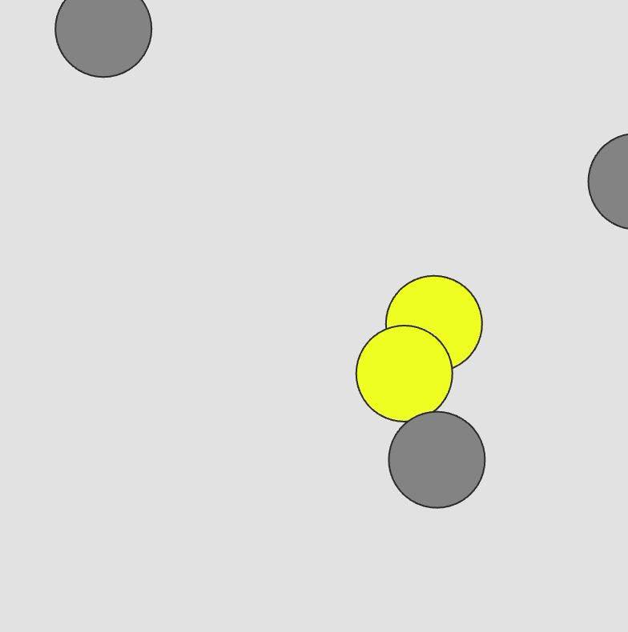

# Week 05 — Dynamic Systems & Collisions

---

### Activities

| Activity | What I Made                   |
| -------- | ----------------------------- |
| `5a`     | Explored collision detection by making multiple moving balls bounce around and change color when they collide. |

---

### This Week

I explored how objects can interact through collision detection. I learned to use dist() to check the distance between objects and trigger different responses when they collide. I also used Boolean variables to control object states and behaviors.

---

### Output

---