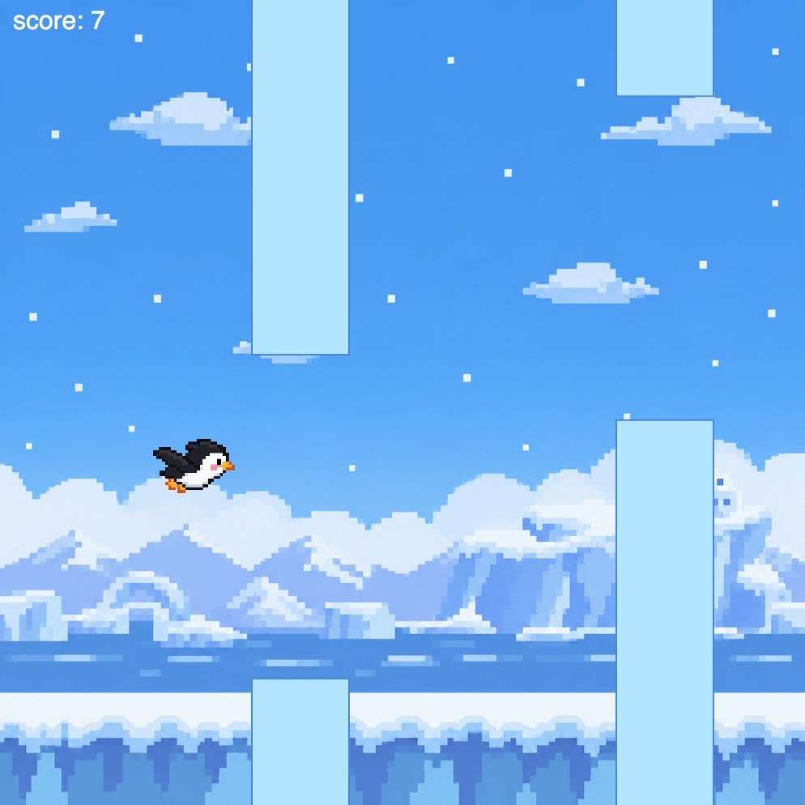
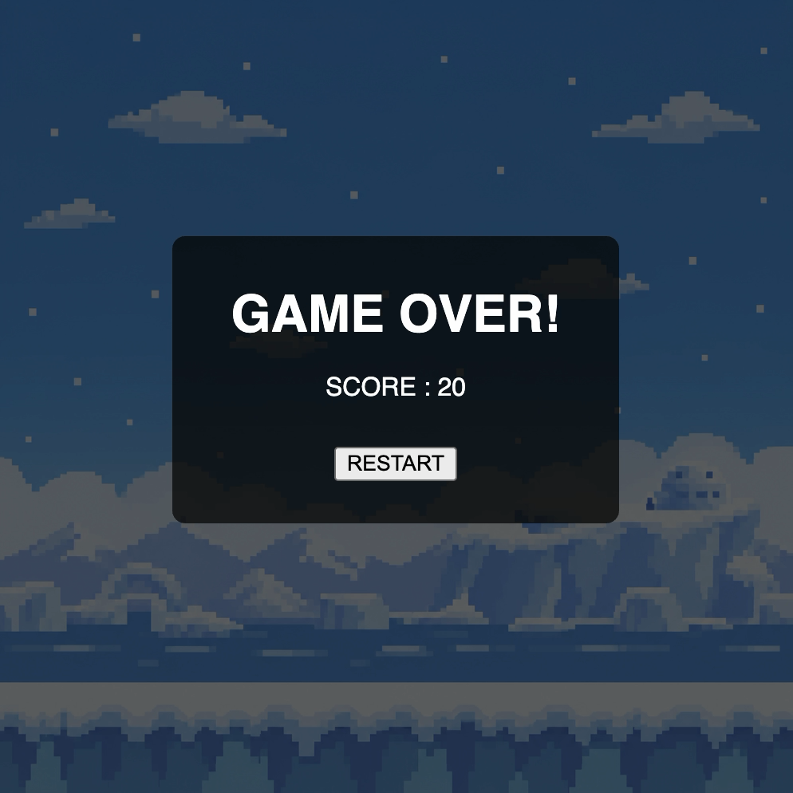

# Mini Project — The Flying Penguin

---

### The Project

"The Flying Penguin" is my reinterpretation of the classic Flappy Bird game. 
The concept started with a simple question. What if a bird that cannot fly decided to fly?

Inspired by the idea of a "first penguin", one that takes the first leap despite uncertainty, I turned the original Flappy Bird scaffold into a game about a penguin attempting to fly through the sky.

I implemented the core gameplay logic, including player controls, pipe creation, collision detection, scoring, game-over and restart states. I also redesigned the game with custom visuals, a flying penguin character, and background music to create a more cohesive theme.

---

### Output

[Watch Online](https://youtube.com/shorts/CB1UOEvssjA?feature=share)

---

### ✍️ Reflection

I chose to work with the Flappy Bird scaffold. I wanted to keep its simple flying mechanic while giving the game a different meaning and visual identity. My concept was inspired by the idea of a "flightless bird" trying to fly. I was also interested in the "first penguin" metaphor which is the first individual to take a risk and step into the unknown. This led me to create "The Flying Penguin", where a penguin attempts to fly through the sky.

Starting from the provided scaffold, I completed the main gameplay logic by implementing keyboard controls, continuous pipe creation, collision detection, scoring, game-over behavior, and a restart system. The player uses the space bar or up arrow to make the penguin flap. The score increases by one whenever the penguin successfully passes an obstacle, and it resets to zero when the game restarts.

For the aesthetic direction, I replaced the original bird with a custom penguin image and added a new background to establish the world of the game. I also added background music that begins when the player first moves and stops when the game ends.

One challenge I encountered was displaying the background image correctly. The background kept appearing as only one-quarter of the full image, and it took me some time to figure out why. I eventually realized that imageMode(CENTER) used for the penguin was also affecting the background image. I solved the problem by using push() and pop() around the penguin's imageMode(CENTER), so that the setting only applies to the penguin image.

If I had more time, I would add more detailed feedback such as sound effects, animated obstacles, particles, and different stages as the penguin flies further.

---

### ✨ What I Changed
- Implemented keyboard controls using the space bar and up arrow
- Added continuous obstacle creation
- Implemented collision detection and game-over behavior
- Added a scoring system
- Added a restart button and reset logic
- Replaced the original bird with a custom flying penguin image
- Added a custom background
- Added background music that responds to the game state
- Redesigned the score and game-over UI

### 🔍 Code Structure
- `sketch.js`: main game loop, game states, scoring, and restart behavior
- `bird.js`: contains the `Bird` class
- `pipe.js`: contains the `Pipe` class
- `assets/`: contains the penguin image(ChatGPT Image Generation (OpenAI)), background image(ChatGPT Image Generation (OpenAI)), and background music(free music: https://www.youtube.com/watch?v=llRnaujvtAk&t=1s)

### 🔗 References
- BBC Flying Penguins: https://www.youtube.com/watch?v=9dfWzp7rYR4